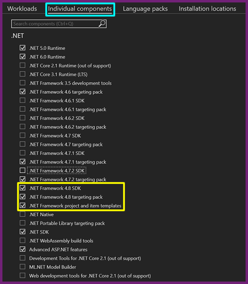
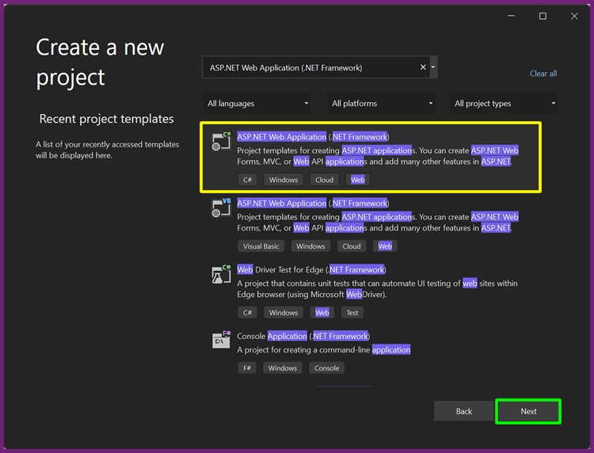
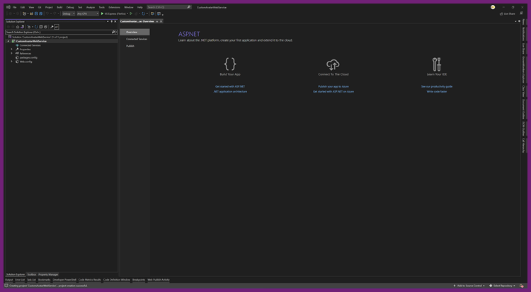
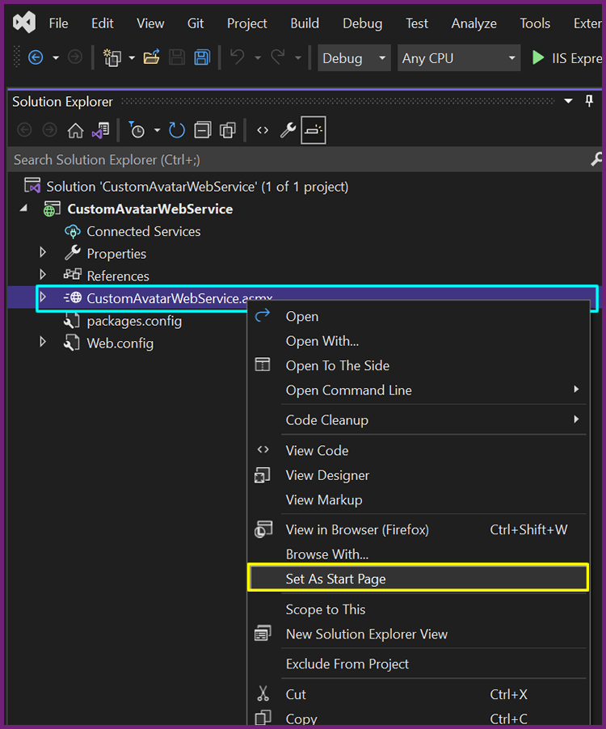

<!-- 220503.110300 -->

# Creating a custom myAvatar™ web service from scratch

>Last updated: February 22, 2023 by [Chris Banwarth](https://github.com/APrettyCoolProgram)

***

### CONTENTS

[Introduction](#introduction)<br>
[Setting up Visual Studio Community 2022](#setting-up-visual-studio-community-2022)<br>
[Creating a new web service project](#creating-a-new-web-service-project)<br>
[The ASMX Web Service component](#the-asmx-web-service-component)<br>
[The Netsmart ScriptLink Service](#the-netsmart-scriptlink-service)<br>
[Adding required methods](#adding-required-methods)<br>
[Next steps](#next-steps)

***

# Introduction

[Netsmart's myAvatar™](https://www.ntst.com/Solutions-and-Services/Offerings/myAvatar) is a behavioral health EHR that offers a recovery-focused suite of solutions that leverage real-time analytics and clinical decision support to drive value-based care.

While myAvatar™ is a robust platform, like most things in life (except [Heroes of Might and Magic III](https://www.gog.com/game/heroes_of_might_and_magic_3_complete_edition)), it isn't perfect. The good news is that myAvatar™ functionality can be extended via Netsmart's myAvatar™ Web Services, and/or custom web services that are written by myAvatar™ users.

When I started to develop my own custom web service for myAvatar™ - [MAWS](https://github.com/spectrum-health-systems/MAWS) - there was a dearth of information about how to start. I created the first version of this manual to document the steps I took to create the basic foundation for a custom web service.

At Netsmart Connections 2022, it became evident other myAvatar™ clients were interested in creating their own custom web services, but didn't know where to start. So I've updated the documentation with the hope that it will help new developers to get started faster.

You can also view the completed template sourcecode [here](https://github.com/myAvatar-Development-Community/custom-avatar-web-service-template).

## Requirements

* [**Visual Studio Community 2022**](https://visualstudio.microsoft.com/vs/)<br>
Technically you can use any IDE/text editor to write custom web services, but the Visual Studio IDE makes some of the necessary setup really easy.

* [**.NET Framework 4.8.x**](https://dotnet.microsoft.com/en-us/download/dotnet-framework/net48)<br>
Unfortunately .NET 6 - the current version of the .NET platform - does not support web services built on the SOAP messaging protocol that myAvatar™ uses. Microsoft's .NET Framework does, however, so we will be using .NET Framework 4.8 to build our custom web service.

* **An understanding of the C# programming language**<br>
I write my web services in C#, but you can use whichever language you would like to write your custom 
web service (assuming it supports the SOAP messaging protocol).

* **A place to host your web service that your myAvatar™ environments have access to** (via HTTPS)

<br>

# Setting up Visual Studio Community 2022

The first step in creating a new custom web service for myAvatar™ is to make sure your development environment has everything it needs.

### Installing Visual Studio Community 2022

If Visual Studio Community 2022 isn't installed on your system, you'll need to download the [Visual Studio installer](https://visualstudio.microsoft.com/vs/), then launch the Visual Studio installer and install the required [workloads](#required-workloads) and [components](#required-components).

### Modifying an existing Visual Studio Community 2022 installation

If Visual Studio Community 2022 is already installed on your system, launch the Visual Studio installer and verify the required [workloads](#required-workloads) and [components](#required-components) are installed.

### Required workloads

To create a custom web service for myAvatar™, you will need to install the following Visual Studio 2022 workloads:
  * `ASP.NET and web development`
  * `Azure development`
  * `.NET desktop development`

<h4 align="center">

  
  <br>
  You need these!
  
</h4>

### Required components

To create a custom web service for myAvatar™, you will also need to install the following Visual Studio 2022 components:
* `.NET > .NET Framework 4.8 SDK`
* `.NET > .NET Framework 4.8 targeting pack`
* `.NET > .NET Framework project and item templates`

<h4 align="center">

  
  <br>
  You also need these!
  
</h4>

<br>

# Creating a new web service project

Now that our development environment has everything it needs, we can create an empty ASP.NET Web Application project in Visual Studio 2022.

To begin, launch Visual Studio 2022.

## Create a new project

When Visual Studio 2022 launches, you should see the "Get Started" page.

<h4 align="center">

  
  <br>
  Just a new project, nothing to see here.
  
</h4>

Click **Create a new project**.

More specifically, we are going to create an *ASP.NET Web Application (.NET Framework)* project.

The easiest way to do this is to:
* Leave the language dropdown as `All languages`
* Leave the platform dropdown as `All platforms`
* Leave the project type dropdown as `All project types`
* In the search bar type `"ASP.NET Web Application (.NET Framework)"`

<h4 align="center">

  
  <br>
  Easy peasy.
  
</h4>

The first option should be `C# ASP.NET Web Application (.NET Framework)`. 

<h4 align="center">

  
  <br>
  Pay no attention to the Decepticon color scheme.
  
</h4>

Click `C# ASP.NET Web Application (.NET Framework)`, and you will notice it becomes highlighted.

Click **Next**.

## Configure your new project

On the Configuring your new project window:
* Change the Project name to the name of your project (e.g., "CustomAvatarWebService")
* Verify that the Location where you want your sourcecode is correct
* Verify that the framework is `.NET Framework 4.8`

<h4 align="center">

  
  <br>
  Mess this up, start all over.
  
</h4>

Click **Create**.

## Create a new ASP.NET Web Application

Finally, on the Create a new ASP.NET Web Application window, choose "Empty".

<h4 align="center">

  
  <br>
  Almost done!
  
</h4>

Click **Create**.

Visual Studio will take a few minutes to create your new ASP.NET Web Application, and when it complete you will be presented with this beaut of a screen:

<h4 align="center">

  
  <br>
  TA-DA!
  
</h4>

<br>

# The ASMX Web Service component

Your project will need the "Web Service (ASMX)" component to function.

## Adding a ASMX Web Service component to your project

1. Right-click on your *project* (e.g., "CustomAvatarWebService")
2. Choose `Add > New item`.

<h4 align="center">

  
  <br>
  Project > Add > New Item
  
</h4>

In the *Add New Item* window
1. Go to `Visual C# > Web`
3. Choose **Web Service (ASMX)**
4. Name the web service (e.g. "CustomAvatarWebService.asmx")

<h4 align="center">

  
  <br>
  Project > Add > New item
  
</h4>

Click **Add**.

## Set the ASMX Web Service component as the start page

Right click on the ASMX Web Service you added (e.g, "CustomAvatarWebService.asmx")
Click **Set as Start Page**

<h4 align="center">

  
  <br>
  Set the ASMX (Web Service) as the start page for your project.
  
</h4>

Click **Set as Start Page**.

<br>

# ScriptLinkStandard

Your project also needs the [ScriptLinkStandard](https://rcskids.github.io/ScriptLinkStandard/) project to function.

To do this:

1. Create a new folder for third party components

Right-click your web service solution, and choose "Add > New Solution Folder", and create a folder named "ThirdParty".

2. Create a new folder called "ThirdParty/" in your project, then copy the ScriptLinkStandard project to ThirdParty/

3. Right click the ThirdParty/ Solution Folder and click "Add > Existing Project", then add the ScriptLinkStandard.csproj file.

4. Right click on your *project* , choose `Add > Reference`, and choose ScriptLinkStandard.

# Adding required methods

We're in the endgame now.

Custom web services that interface with myAvatar™ ***require*** the following two methods to be present:
* `GetVersion()`
* `RunScript()`

***If these methods aren't present, your web service won't work!***

For the purposes of this documentation, I'm going to assume you named your project "CustomAvatarWebService".

## The default .asmx.cs file

Your shiny, brand new *CustomAvatarWebService.asmx.cs* file should look like this:

```
using System.Web.Services;

namespace CustomAvatarWebService
{
    [WebService(Namespace = "http://tempuri.org/")]
    [WebServiceBinding(ConformsTo = WsiProfiles.BasicProfile1_1)]
    [System.ComponentModel.ToolboxItem(false)]
    // To allow this Web Service to be called from script, using ASP.NET AJAX, uncomment the following line. 
    // [System.Web.Script.Services.ScriptService]
    public class CustomAvatarWebService : System.Web.Services.WebService
    {
        [WebMethod]
        public string HelloWorld()
        {
            return "Hello World";
        }
    }
}
```

## Removing the `HelloWorld()` method

We don't need the `HelloWorld()` method, so you can remove it.

Now *CustomAvatarWebService.asmx.cs* should look like this:

```
using System.Web.Services;

namespace CustomAvatarWebService
{
    [WebService(Namespace = "http://tempuri.org/")]
    [WebServiceBinding(ConformsTo = WsiProfiles.BasicProfile1_1)]
    [System.ComponentModel.ToolboxItem(false)]
    // To allow this Web Service to be called from script, using ASP.NET AJAX, uncomment the following line. 
    // [System.Web.Script.Services.ScriptService]
    public class CustomAvatarWebService : System.Web.Services.WebService
    {

    }
}
```

## The `GetVersion()` method

### What does the `GetVersion()` method do?
The `GetVersion()` method simply returns the version of your custom web service.

### Adding the `GetVersion()` method to CustomAvatarWebService.asmx.cs

The `GetVersion()` method looks like this:

```
[WebMethod]
public string GetVersion()
{
    return "VERSION 1.0";
}
```

Just copy that code and paste it where the `HelloWorld()` method used to be.

Now *CustomAvatarWebService.asmx.cs* should look like this:

```
using System.Web.Services;

namespace CustomAvatarWebService
{
    [WebService(Namespace = "http://tempuri.org/")]
    [WebServiceBinding(ConformsTo = WsiProfiles.BasicProfile1_1)]
    [System.ComponentModel.ToolboxItem(false)]
    // To allow this Web Service to be called from script, using ASP.NET AJAX, uncomment the following line. 
    // [System.Web.Script.Services.ScriptService]
    public class CustomAvatarWebService : System.Web.Services.WebService
    {
        [WebMethod]
        public string GetVersion()
        {
            return "VERSION 1.0";
        }
    }
}
```

## The `RunScript()` method

The `RunScript()` method is what myAvatar™ calls via a ScriptLink event in a form. 

This method:
* Accepts an OptionObject2015 sent from myAvatar™
* Does something with the data within that object*
* Returns a modified object* to myAvatar™.

<h6>
*<i>Potentially!</i>
</h6>

## Adding the `RunScript()` method to CustomAvatarWebService.asmx.cs

The `RunScript()` method looks like this:

```
[WebMethod]
public OptionObject2015 RunScript(OptionObject2015 sentOptionObject, string action)
{
    switch(action)
    {
        case "doSomething":
            return MethodName(sentOptionObject);
        
        default:
            break;
    }
    
    return sentOptionObject;
}
```

Just copy that code and paste it after the `GetVersion()` method.

Now *CustomAvatarWebService.asmx.cs* should look like this:

```
using System.Web.Services;

namespace MyAvatoolWebService
{
    [WebService(Namespace = "http://tempuri.org/")]
    [WebServiceBinding(ConformsTo = WsiProfiles.BasicProfile1_1)]
    [System.ComponentModel.ToolboxItem(false)]
    // To allow this Web Service to be called from script, using ASP.NET AJAX, uncomment the following line. 
    // [System.Web.Script.Services.ScriptService]
    public class MyAvatoolWebService : System.Web.Services.WebService
    {
        [WebMethod]
        public string GetVersion()
        {
            return "VERSION 1.0";
        }

        [WebMethod]
        public OptionObject2015 RunScript(OptionObject2015 sentOptionObject, string action)
        {
            switch(action)
            {
                case "DoSomething":
                    return MethodName(sentOptionObject);
                
                default:
                    break;
            }
            
            return sentOptionObject;
        }
    }
}
```

## The `MethodName()` method

When myAvatar™ reaches out to your custom web service, it's going to ask it to perform some kind of *action*.

You'll notice in the `RunScript()` code above there is an `action` parameter that is passed. That is the *action* myAvatar™ is requesting (via a ScriptLink *paramater* in myAvatar™).

For this tutorial, let's pretend that the action myAvatar™ is requesting is to "doSomething".

You'll see that the switch statement has a case for "DoSomething", and that case calls the `MethodName()` method. So when myAvatar™ requests that our web services "DoSomething", the code in `MethodName()` will run.

A more real-world example would be myAvatar™ requesting a "CheckDate" action be performed, and our web service would then execute the code in a method named `CheckTheDatePlease()`.

The `RunScript()` method  in that example would look like this:

```
[WebMethod]
public OptionObject2015 RunScript(OptionObject2015 sentOptionObject, string action)
{
    switch(action)
    {
        case "CheckDate":
            return CheckTheDatePlease(sentOptionObject);

        default:
            break;
    }

    return sentOptionObject;
}
```

And then we would have a method called `CheckTheDatePlease()` that would do whatever date checking you need, via code that you write.

For this tutorial, we are just going to create a method called `MethodName()`, which looks like this:

```
private static OptionObject2015 MethodName(OptionObject2015 sentOptionObject)
{
    // You'll write the logic you need here.
    return new OptionObject2015();
}
```

Copy the `MethodName()` method code above, and paste it below the `RunScript()` method.

Now *CustomAvatarWebService.asmx.cs* should look like this:

```
using System.Web.Services;

namespace CustomAvatarWebService
{
    [WebService(Namespace = "http://tempuri.org/")]
    [WebServiceBinding(ConformsTo = WsiProfiles.BasicProfile1_1)]
    [System.ComponentModel.ToolboxItem(false)]
    // To allow this Web Service to be called from script, using ASP.NET AJAX, uncomment the following line. 
    // [System.Web.Script.Services.ScriptService]
    public class CustomAvatarWebService : System.Web.Services.WebService
    {
        [WebMethod]
        public string GetVersion()
        {
            return "VERSION 1.0";
        }

        [WebMethod]
        public OptionObject2015 RunScript(OptionObject2015 sentOptionObject, string action)
        {
            switch(action)
            {
                case "DoSomething":
                    return MethodName(sentOptionObject);
                
                default:
                    break;
            }
            
            return sentOptionObject;
        }

        private static OptionObject2015 MethodName(OptionObject2015 sentOptionObject)
        {
            // You'll write the logic you need here.
            return new OptionObject2015();
        }
    }
}
```

## Adding the NTST.ScriptLinkService.Objects namespace to your asmx file

At this point, you probably have some warnings in your code in the form of red underlines. Most likely you are getting these warnings under the text for `OptionObject2015` and `MethodName`. You are getting these warnings becuase your project doesn't know what `OptionObject2015` and `MethodName` are. 

To fix this, find the this line at the very top of your asmx file:

```
using System.Web.Services;
```

Then add the following line below that:

```
using NTST.ScriptLinkService.Objects;
```

Now the *CustomAvatarWebService.asmx.cs* file is **complete**, and should look like this:

```
using System.Web.Services;
using NTST.ScriptLinkService.Objects;

namespace CustomAvatarWebService
{
    [WebService(Namespace = "http://tempuri.org/")]
    [WebServiceBinding(ConformsTo = WsiProfiles.BasicProfile1_1)]
    [System.ComponentModel.ToolboxItem(false)]
    // To allow this Web Service to be called from script, using ASP.NET AJAX, uncomment the following line. 
    // [System.Web.Script.Services.ScriptService]
    public class CustomAvatarWebService : System.Web.Services.WebService
    {
        [WebMethod]
        public string GetVersion()
        {
            return "VERSION 1.0";
        }

        [WebMethod]
        public OptionObject2015 RunScript(OptionObject2015 sentOptionObject, string action)
        {
            switch(action)
            {
                case "DoSomething":
                    return MethodName(sentOptionObject);
                
                default:
                    break;
            }
            
            return sentOptionObject;
        }

        private static OptionObject2015 MethodName(OptionObject2015 sentOptionObject)
        {
            return new OptionObject2015();
        }
    }
}
```

# Next steps

TBD